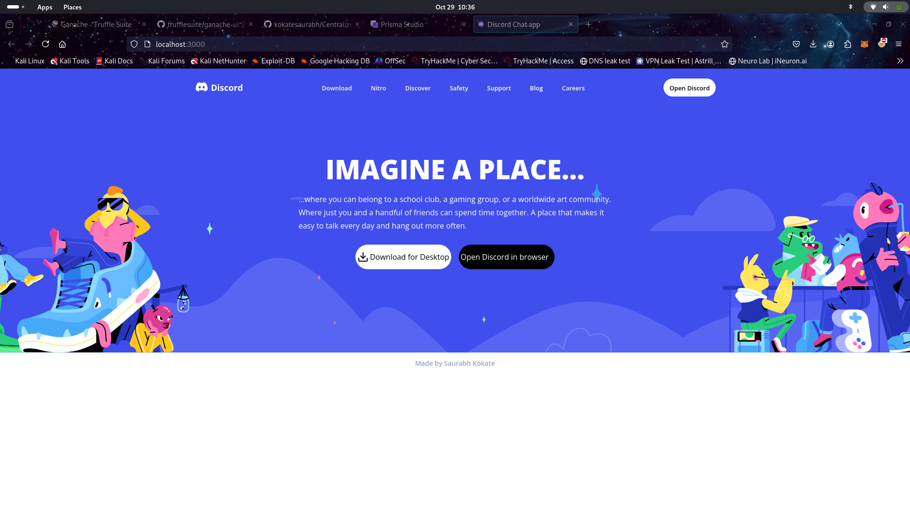

# 🚀 Centralized-D3scord Clone - Full-Stack Web App 🌐

  
  
  

---

## 📖 Overview

> **Immersive, real-time communication with a Discord-inspired UI!**  
This **Discord Clone** is a full-stack app with robust features for text, audio, and video interactions. Developed with **Next.js 14**, **React**, **Socket.io**, **Prisma**, **TailwindCSS**, and **MySQL**, this project is designed for instant communication and dynamic, real-time updates.

> **🔧 Deployed on Railway** for reliable scaling and performance.

---

## 🎬 Demo Video

> Watch a full preview of the **Discord Clone** in action!

  <video width="720" height="400" controls>
    <source src="./assets/Centralized-D3scord.mp4" type="video/mp4">
    Your browser does not support the video tag.
  </video>

---

## 🌟 Key Features

- **Real-Time Messaging** with Socket.io
- **Multimedia Attachments** via UploadThing
- **Edit & Delete** messages in real-time
- **Channel Variety**: Text, Audio, and Video
- **Role Management**: Grant roles and control permissions
- **Unique Invite Links** for easy server joining
- **Server Customization** to personalize community spaces
- **Infinite Scroll** with tanstack/query
- **Responsive Design** with Light/Dark Modes

---

## 🤝 Connect

Stay connected for updates and improvements!

- **[LinkedIn - Saurabh Kokate](http://linkedin.com/in/saurabh-kokate-b839b921a)**
- **GitHub: [kokatesaurabh](https://github.com/kokatesaurabh/Centralized-D3scord)**

---

**Enjoy seamless chatting and community interactions!** 📝✨
